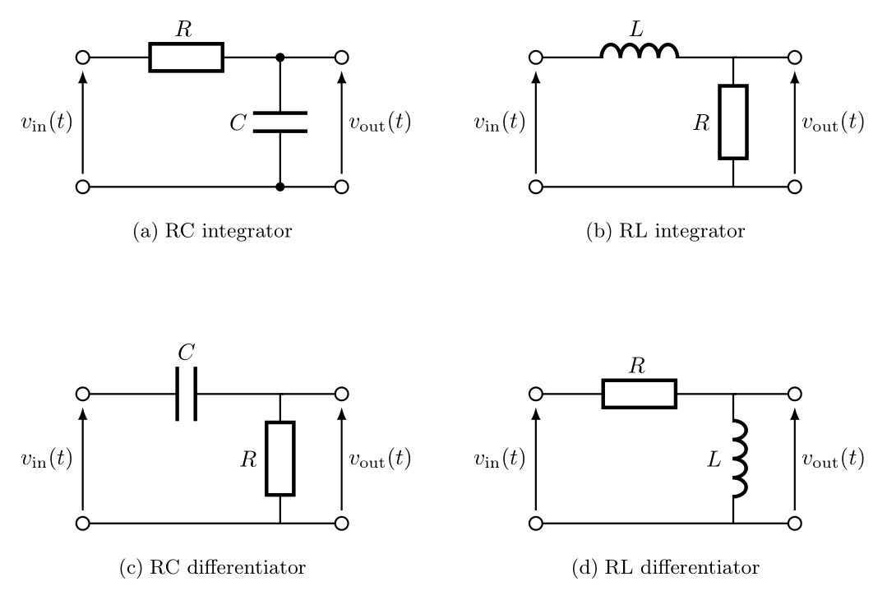

# tikz-library
Reusable TikZ figures for reports.

## Circuits

### Integrator and Differentiator Circuits (RC / RL)
Comparison of RC and RL integrator and differentiator circuits.

## Circuit Catalog

- **RC integrator**  
  Source: `tikz/circuits/rc_integrator.tex`

- **RL integrator**  
  Source: `tikz/circuits/rl_integrator.tex`

- **RC differentiator**  
  Source: `tikz/circuits/rc_differentiator.tex`

- **RL differentiator**  
  Source: `tikz/circuits/rl_differentiator.tex`
